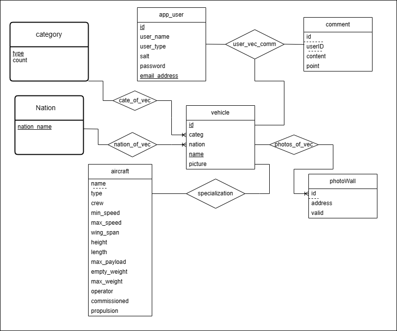

# 数据库大作业报告

|姓名|学号|负责的工作|
|:---|:---|:---|
|关钰锋|21312708|产品设计、前后端设计、数据爬取、数据库设计|
|罗蔚旗|21307247|产品设计、前端设计、后端修改、Web部署|

## 1 应用介绍

## 2 应用设计
访问我们的网页!

https://www.cold-front.top

该产品主要是作为一个军武类载具大全，实现了相册展示，分类检索，载具详解，评论和照片墙上传功能。

### 开发平台
* centos 7.6
* opengauss 5.0.0
* docker
* java21 + springboot 3.2.1
* vue3

### 功能实现

**用户管理模块**

该模块管理用户的注册与登录信息，使用cookie发放获取访客状态，由于网站拥有评论与照片上传等高互动性的功能，要求用户登陆后才能评论与上传图片；否则只能浏览展示页与各载具详情页。

**展示模块**

模块用于展示信息，实现首页相册展览，各载具具体的详情页，和分类检索展示

**评论与排行**

对于军事爱好者的用户，对于自己喜欢的飞机或者车辆坦克一定有话要说，有东西要解读。

该模块用于提交评论，维护和展示各载具下的评论与评分，可以实时计算出各载具的评分进行排行。

**照片墙**

对于渴望见到他们心爱的飞机坦克的用户，只有一张略所图是不够的，因此该网站支持他们上传自己收藏的照片。

该模块用于用户上传图片，维护这些照片并给管理员提供审核图片的功能，并在详情页开启时发送对应载具的照片墙。

### 2.1 前端开发


### 2.2 后端开发
后端使用JAVA21+springboot框架写成，详情如下：
#### 整体框架

```
project
 |-src-- main
          |-databaseApp 
                  |-config             # 一些控制，例如跨域设置，拦截器设置
                  |-intercepter        # 拦截器
                  |-entity             # 表格的模式
                  |-mapper             # 映射数据库操作方式，用于在程序中直接操作的接口
                  |-service            # 业务层，用于组织mapper中的操作的用法形成像注册，登录等服务
                  |-controller         # 控制层，调用业务层完成相应操作并处理异常
                        |-exception    # 处理异常
                        |-implement    # 业务实际响应接口与响应操作
                  |-util               # 控制层，接受和发送来自网页的JSON进行响应处理
                  |-DatabaseApplication.java   #主函数入口
          |-resource
                  |-mapper             # 实际SQL语句存在的地方，通过mapper与上面的接口组成映射
                  |-application.yml    #设置程序主要参数
```
#### 与前端交互接口

*  `/`  主页面，展示所有Vehicle的概览信息，向上传一个Json的List

* `/{vid}`  某个vehicle的详细信息页面

* `/{vid}/photowall`  某个vehicle的照片墙，跟上面详细页面一起拉起显示在同一个页面

* `/{vid}/commentpage` 某个vehicle的评论页，和上面详细页面一起拉起显示在同一个页面

* `/comment/{vid}` 发起评论，传入一个Comment结构体的数据类，进行评论（POST方法）；此处有拦截器阻拦；

* `/rank`  显示排行榜

* `/type/{cate}`   按类进行分类查询

* `/nation/{Nat}`    按国家进行分类查询

* `/users/reg`      用户注册

* `/users/login`    用户登录

* `/users/Forgetpassword`   修改密码

* `/admin/auditview`  管理员的审核视图，发一些未经审核的图片到页面

* `/admin/audit`    管理员的审核操作，传入某个图片的地址和id

* `/upload/photo`     用户上传图片（POST方法）

* `/upload/vehicle`  用户上传新载具

### 2.3 数据库设计

本应用使用openGauss数据库，装在在服务器的docker中，通过端口映射到服务器8888端口，在一个schema中一共维护了7个表：

* `vehicle`维护所有载具；
* `category`维护所有载具的类与每个类的个数；
* `nation`维护所有载具的国别；
* `aircaft`表对应category的一个类别，展示对应vehicle的详细信息；
* `comment`存储所有评论；
* `photowall`存储每个vehicle的照片
* `app_user`存储用户信息

其E-R图如下



下面列出每个表的详细信息

#### nation
```sql
CREATE TABLE nation (
    nation_name varchar(10) primary key);
```

#### category
```sql
CREATE TABLE category (
    type varchar(10) primary key,   --型号，目前包含飞机，船舶，坦克，潜水艇，汽车
    count integer NOT NULL);              --数量
```


#### veihicle
```sql
CREATE TABLE vehicle(
    catag varchar(10) foreign key category(type),  --类别
    id serial primary key,       --id，使用serial形式可以插入自增
    nation varchar(10) foreign key nation(nation_name),  --国别 
    name varchar(70) unique not null,          --名字，必须是独特的
    picture varchar(200));             --首图地址
```

#### aircraft
aircraft原本是作为vehicle的子类继承，是vehicle的特化，但是openGauss中不支持inherits，因此将name作为外键与vehicle一一对应，vehicle中不同的分类对应不同的特化类，目前只做出了aircraft

```sql
CREATE TABLE aircraft (
    name varchar(70) foreign key vehicle(name),     --名称
    type varchar(50),                   --服役类型（海军，空军，民用）
    crew integer,                       --载员
    min_speed varchar(10),    
    max_speed varchar(10) , 
    wing_span varchar(10) , 
    height varchar(10) , 
    length varchar(10) , 
    max_payload varchar(10) , 
    empty_weight varchar(10) , 
    max_weight varchar(10) , 
    operator varchar(60) , 
    commissioned integer ,                --服役年限
    propulsion varchar(50) );    --发动机型号

```

#### app_user
```sql
CREATE TABLE app_user (
    id serial primary key,             --用户ID，使用serial形式可以插入自增
    user_name varchar(20),      --用户名
    user_type boolean,                  --用户类型，0为管理员
    salt character(36),                 --盐值
    password varchar(128) ,    --md5后的密码
    email_address varchar(40) UNIQUE);    --邮箱
```


#### Comment
```sql
CREATE TABLE comment (
    id integer foreign key references vehicle(id),      --vehicle的id
    userid integer foreign key references app_user(id),    --user的id
    content varchar(1000) NOT NULL, 
    point smallint);                 --评分  
```

#### photowall
用户上传照片后，存取图片在本地路径，然后将路径写入address项

```sql
CREATE TABLE photowall (
    id integer foreign key references vehicle(id),      -- vehicleID
    address varchar(300) NOT NULL,          --文件路径
    valid boolean);                           --审核是否通过
```


## 3 数据来源
数据来自`cmano-db.com`，为境内合法网站，在应用的首页已经重点鸣谢

使用python的爬虫包，在目录下`dataFetcher`给出，首先
```py
url = 'https://cmano-db.com/aircraft/China/'# 首页网址URL
source_html  = requests.get(url=url, headers=headers).text# 请求发送
tmp_html = "China.html"          #将前端html写入本地文件
with open(tmp_html, "r", encoding="utf-8") as f:
    f.write(source_html)
    f.seek(0)
    html_handle = f.read()

tree = etree.HTML(html_handle)      #构建html层次树

Link=[i.strip() for i in tree.xpath("//div[@class='row']/div/table/tbody/tr/td/a/@href")]       #使用html的xpath匹配检索详细页超链接
name = [i.strip() for i in tree.xpath("//div[@class='row']/div/table/tbody/tr/td/a/text()")]   #记录名字
```
得到了每个详细页的超链接后，遍历Link链表使用get方法，重复以上的步骤，获取到飞机的详细信息


## 4 效果展示

## 5 总结感想