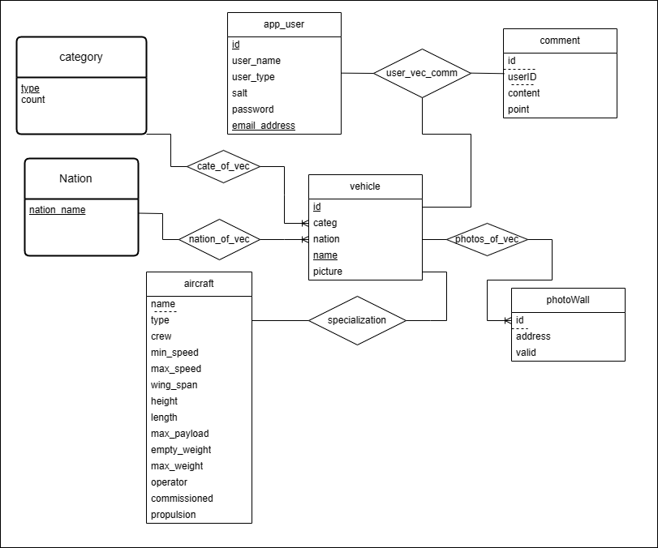
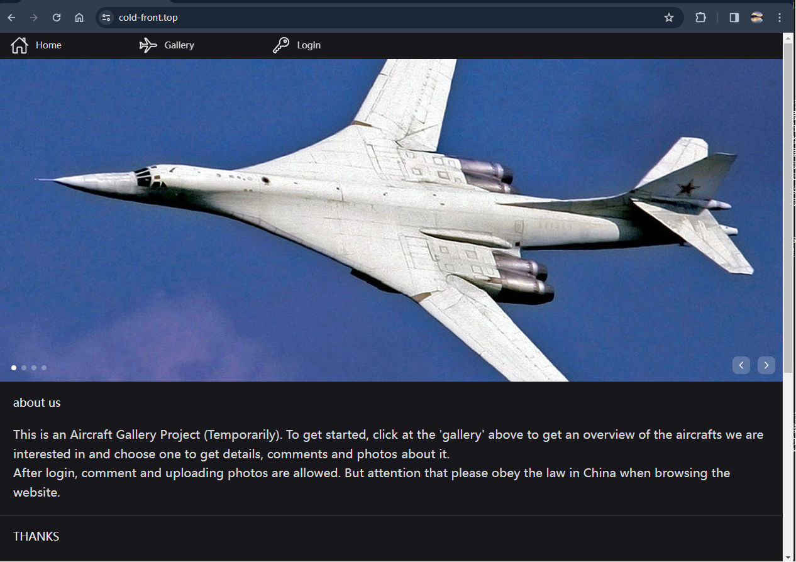
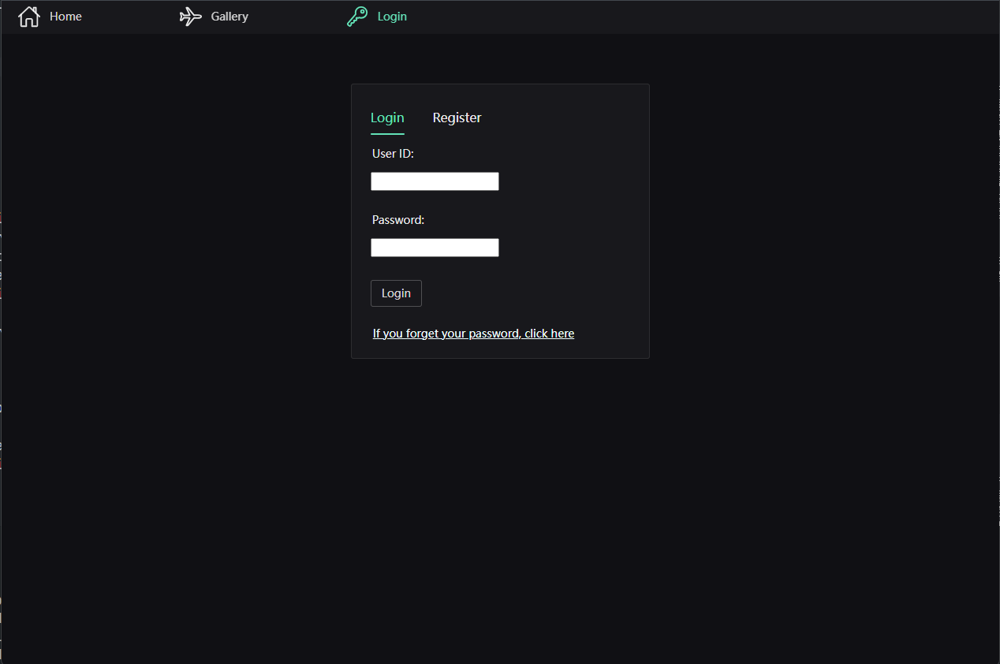
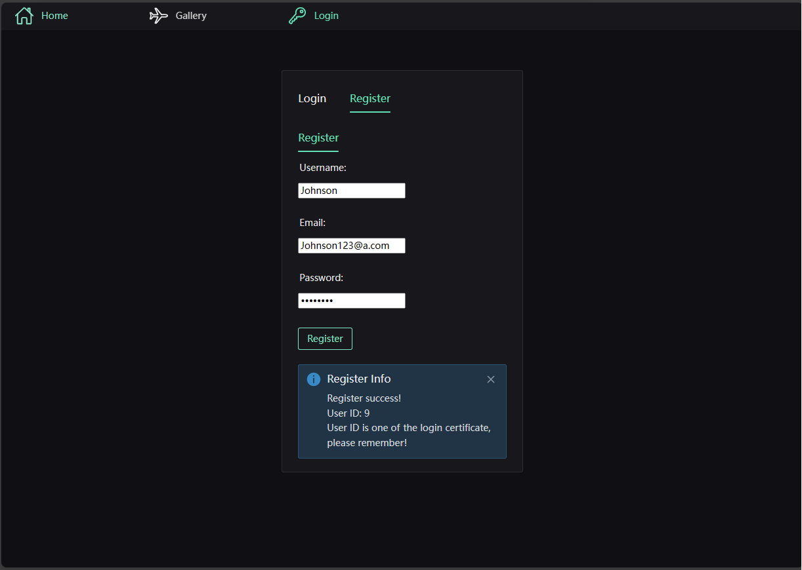
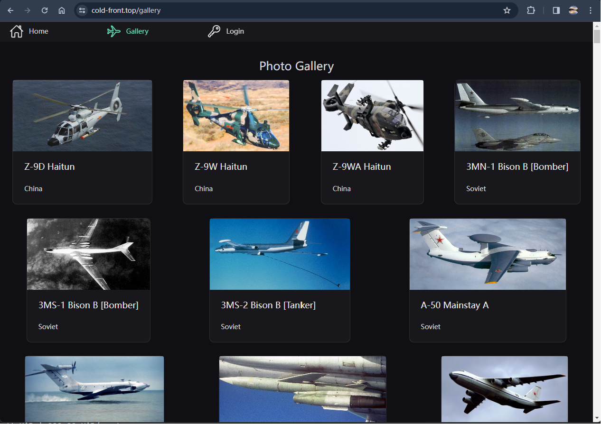
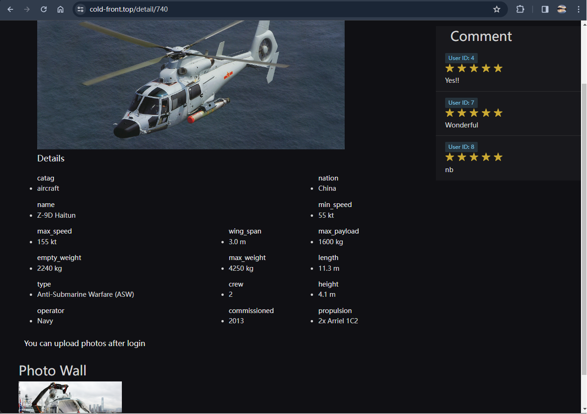

# 数据库大作业报告

|姓名|学号|负责的工作|
|:---|:---|:---|
|关钰锋|21312708|产品设计、前后端设计、数据爬取、数据库设计|
|罗蔚旗|21307247|产品设计、前端设计、后端修改、Web部署|

## 1 应用需求介绍

访问我们的网页!

https://www.cold-front.top

该产品主要是作为一个军武类载具大全，实现了相册展示，分类检索，载具详解，评论和照片墙上传功能。

### 功能实现

**用户管理模块**

该模块管理用户的注册与登录信息，使用cookie发放获取访客状态，由于网站拥有评论与照片上传等高互动性的功能，要求用户登陆后才能评论与上传图片；否则只能浏览展示页与各载具详情页。

**展示模块**

模块用于展示信息，实现首页相册展览，各载具具体的详情页，和分类检索展示

**评论与排行**

对于军事爱好者的用户，对于自己喜欢的飞机或者车辆坦克一定有话要说，有东西要解读。

该模块用于提交评论，维护和展示各载具下的评论与评分，可以实时计算出各载具的评分进行排行。

**照片墙**

对于渴望见到他们心爱的飞机坦克的用户，只有一张略所图是不够的，因此该网站支持他们上传自己收藏的照片。

该模块用于用户上传图片，维护这些照片并给管理员提供审核图片的功能，并在详情页开启时发送对应载具的照片墙。


## 2 应用系统设计

### 开发平台

* centos 7.6
* opengauss 5.0.0
* docker
* java21 + springboot 3.2.1
* vue3

### 2.1 前端开发

#### 前端设计

前端使用 Vue + Vue-router + Axios + Pinia + Naive-UI 完成

Vue 是一款用于构建用户界面的 JavaScript 框架，它基于标准 HTML、CSS 和 JavaScript 构建，并提供了一套声明式的、组件化的编程模型，能够高效开发用户见面。

网站以深灰色、绿色为主色调设计，UI 设计使用 Naive-UI 的组件库完成，主要分为四个页面板块：首页、画廊页、登录页和详情页


#### 项目结构

```
project
|-index.html     # 入口 html
|-package.json   # nodejs 配置文件
|-vite.config.js # vite 配置代码
|-dist           # 网站部署文件
|-src
    |-assets     # 存放 css 样式文件
    |-components # 存放 vue 单文件组件
    |-router     # vue-router 使用到的路由模块
    |-stores     # pinia 使用到的存储模块
    |-views      # 存放 view vue 组件
    |-App.vue    # vue 的根组件
    |-main.js    # 入口 javascript 代码
```

#### 前端入口

- `index.html` 作为网页的入口，加载 main.js 
- `main.js` 主函数位置，加载 vue 跟组件和各个 js 模块  
```js
import './assets/main.css'
import { createApp } from 'vue'
import pinia from './stores'
import App from './App.vue'
import router from './router'
import axios from 'axios'

// 配置 axios baseurl 和 credentials
axios.defaults.baseURL = 'https://cold-front.top:8080'
axios.defaults.withCredentials = true

const app = createApp(App)
app.use(pinia)
app.use(router)
app.mount('#app')
```
- `App.vue` Vue 的根组件，各个 vue 的模块在这里加载

#### Vue 组件

网站的四个页面对应了 4 个 view 组件，分别为 `DetailView.vue`, `GalleryView.vue`, `HomeView.vue`, `LoginView.vue`，具体代码请看仓库

- `HomeView.vue`

网站首页，加载 `HelloWorld.vue` 组件，提供网页的基础信息

- `GalleryView.vue`

载具展示廊页，展示网站所有的载具基础信息，针对每个载具可以跳转到载具详情页

- `LoginView.vue`

登录页，集成网站登录、注册、密码修改功能，分别对应 `LoginPart.vue`, `RegisterPart.vue`, `ChangePassword.vue` 组件

登录后，浏览器会获得从服务端发来的 cookie，用于详情页的上传评论、图片功能的身份认证

- `DetailView.vue`

载具详情页，提供载具的详细信息，并且加载了 `CommentPart.vue` 和 `PhotoWall.vue`，提供评论和照片墙的功能，上传评论和图片需要验证登录

#### 与后端的交互

与后端的交互使用 axios 完成，axios 是一个基于 promise 网络请求库，作用于 node.js 和浏览器中。 它是 isomorphic 的(即同一套代码可以运行在浏览器和node.js中)，在服务端它使用原生 node.js http 模块。

```js
onMounted(() => {
  axios.get("/")
    .then(result => {
      vehicleList.value = result.data.data
    })
    .catch(err => {
      console.log(err)
    })
})
```

这是 axios 在 gallery 页的一个使用案例，`onMounted` 函数用于 vue 组件在加载时自动调用，axios 调用 `get` 方法（输入 url），返回的结果在 `then` 方法中处理

> 因为 axios get 是异步调用的，所以对返回结果的处理一定要放在 then 中，才能够实现同步

#### 其他模块

- Vue-Router  
Vue 的路由组件，提供页面之间的切换（也就是 view vue 的切换）功能
- Pinia  
Vue 的存储组件，在本次项目中用于存储用户登录信息，以及登录登出的方法
- Naive-UI  
Vue 的组件库，可以导入成熟的组件来设计页面

### 2.2 后端开发
后端使用JAVA21+springboot框架写成，详情如下：
#### 整体框架

```
project
 |-src-- main
          |-databaseApp 
                  |-config             # 一些控制，例如跨域设置，拦截器设置
                  |-intercepter        # 拦截器
                  |-entity             # 表格的模式
                  |-mapper             # 映射数据库操作方式，用于在程序中直接操作的接口
                  |-service            # 业务层，用于组织mapper中的操作的用法形成像注册，登录等服务
                  |-controller         # 控制层，调用业务层完成相应操作并处理异常
                        |-exception    # 处理异常
                        |-implement    # 业务实际响应接口与响应操作
                  |-util               # 控制层，接受和发送来自网页的JSON进行响应处理
                  |-DatabaseApplication.java   #主函数入口
          |-resource
                  |-mapper             # 实际SQL语句存在的地方，通过mapper与上面的接口组成映射
                  |-application.yml    #设置程序主要参数
```
#### 与前端交互接口

*  `/`  主页面，展示所有Vehicle的概览信息，向上传一个Json的List

* `/{vid}`  某个vehicle的详细信息页面

* `/{vid}/photowall`  某个vehicle的照片墙，跟上面详细页面一起拉起显示在同一个页面

* `/{vid}/commentpage` 某个vehicle的评论页，和上面详细页面一起拉起显示在同一个页面

* `/comment/{vid}` 发起评论，传入一个Comment结构体的数据类，进行评论（POST方法）；此处有拦截器阻拦；

* `/rank`  显示排行榜

* `/type/{cate}`   按类进行分类查询

* `/nation/{Nat}`    按国家进行分类查询

* `/users/reg`      用户注册

* `/users/login`    用户登录

* `/users/Forgetpassword`   修改密码

* `/admin/auditview`  管理员的审核视图，发一些未经审核的图片到页面

* `/admin/audit`    管理员的审核操作，传入某个图片的地址和id

* `/upload/photo`     用户上传图片（POST方法）

* `/upload/vehicle`  用户上传新载具

### 2.3 数据库设计

本应用使用openGauss数据库，装在在服务器的docker中，通过端口映射到服务器8888端口，在一个schema中一共维护了7个表：

* `vehicle`维护所有载具；
* `category`维护所有载具的类与每个类的个数；
* `nation`维护所有载具的国别；
* `aircaft`表对应category的一个类别，展示对应vehicle的详细信息；
* `comment`存储所有评论；
* `photowall`存储每个vehicle的照片
* `app_user`存储用户信息

其E-R图如下



下面列出每个表的详细信息

#### nation
```sql
CREATE TABLE nation (
    nation_name varchar(10) primary key);
```

#### category
```sql
CREATE TABLE category (
    type varchar(10) primary key,   --型号，目前包含飞机，船舶，坦克，潜水艇，汽车
    count integer NOT NULL);              --数量
```


#### veihicle
```sql
CREATE TABLE vehicle(
    catag varchar(10) foreign key category(type),  --类别
    id serial primary key,       --id，使用serial形式可以插入自增
    nation varchar(10) foreign key nation(nation_name),  --国别 
    name varchar(70) unique not null,          --名字，必须是独特的
    picture varchar(200));             --首图地址
```

#### aircraft
aircraft原本是作为vehicle的子类继承，是vehicle的特化，但是openGauss中不支持inherits，因此将name作为外键与vehicle一一对应，vehicle中不同的分类对应不同的特化类，目前只做出了aircraft

```sql
CREATE TABLE aircraft (
    name varchar(70) foreign key vehicle(name),     --名称
    type varchar(50),                   --服役类型（海军，空军，民用）
    crew integer,                       --载员
    min_speed varchar(10),    
    max_speed varchar(10) , 
    wing_span varchar(10) , 
    height varchar(10) , 
    length varchar(10) , 
    max_payload varchar(10) , 
    empty_weight varchar(10) , 
    max_weight varchar(10) , 
    operator varchar(60) , 
    commissioned integer ,                --服役年限
    propulsion varchar(50) );    --发动机型号

```

#### app_user
```sql
CREATE TABLE app_user (
    id serial primary key,             --用户ID，使用serial形式可以插入自增
    user_name varchar(20),      --用户名
    user_type boolean,                  --用户类型，0为管理员
    salt character(36),                 --盐值
    password varchar(128) ,    --md5后的密码
    email_address varchar(40) UNIQUE);    --邮箱
```


#### Comment
```sql
CREATE TABLE comment (
    id integer foreign key references vehicle(id),      --vehicle的id
    userid integer foreign key references app_user(id),    --user的id
    content varchar(1000) NOT NULL, 
    point smallint);                 --评分  
```

#### photowall
用户上传照片后，存取图片在本地路径，然后将路径写入address项

```sql
CREATE TABLE photowall (
    id integer foreign key references vehicle(id),      -- vehicleID
    address varchar(300) NOT NULL,          --文件路径
    valid boolean);                           --审核是否通过
```


## 3 数据来源
数据来自`cmano-db.com`，为境内合法网站，在应用的首页已经重点鸣谢

使用python的爬虫包，在目录下`dataFetcher`给出，首先
```py
url = 'https://cmano-db.com/aircraft/China/'# 首页网址URL
source_html  = requests.get(url=url, headers=headers).text# 请求发送
tmp_html = "China.html"          #将前端html写入本地文件
with open(tmp_html, "r", encoding="utf-8") as f:
    f.write(source_html)
    f.seek(0)
    html_handle = f.read()

tree = etree.HTML(html_handle)      #构建html层次树

Link=[i.strip() for i in tree.xpath("//div[@class='row']/div/table/tbody/tr/td/a/@href")]       #使用html的xpath匹配检索详细页超链接
name = [i.strip() for i in tree.xpath("//div[@class='row']/div/table/tbody/tr/td/a/text()")]   #记录名字
```
得到了每个详细页的超链接后，遍历Link链表使用get方法，重复以上的步骤，获取到飞机的详细信息


## 4 效果展示

- 主页

在浏览器地址栏输入 `www.cold-front.top` 后，会自动跳转到项目主页



主页包含了一些项目信息，载具轮播图等，页面上方的导航栏用于跳转到其他页面

- 登录页

点击导航栏的 Login，会跳转到登录页



点击登陆标签中的 Register，可以注册一个账号



注册后会返回一个 UserID 用于登录

如果忘记密码，可以在 Login 标签页中点击下面的忘记密码来更改密码

- 展示廊页

点击导航栏的 Gallery，会跳转到展示廊页，提供载具的简略信息



点击其中的载具信息会跳转到详情页

- 详情页



该页面展示了载具的详细信息，以及用户评论和用户上传的照片，在登录的情况下用户能够上传评论和图片

## 5 总结感想

这此实验，我们组完成了一次较为完整的前后端 web 应用开发，学习到了很多开发方面的知识，主要有几个挑战：

- 数据库设计：

怎样设计数据库，如何使用 openGauss 数据库，并且将爬到的数据存入数据库，这些过程中会遇到各种小问题（前期在安装配置 openGauss 数据库的过程中就遇到了许多阻碍

- 后端设计：

我们组之前没有接触过 Java 语言，在本次项目中，我们根据以往 c/c++ 的开发经验，快速学习上手 java 语言，并且使用 SpringBoot 框架进行后端开发。 这一切在上手之前看起来都很复杂，因为 java 本身涉及的内容、特性就非常之多，SpringBoot 也涉及到了很多 Spring 的特性。 

- 前端设计：

同样的，我们也从没接触过前端开发，对 HTML、CSS、JavaScript 的认知也是寥寥，经过这次开发实践后，我们组对这三件套有了基本的了解，同时也上手了 Vue 的前端框架。前端框架可以实时运行，所见即所得的特性帮助我们针对性的实现我们想要的功能，这个过程中的正反馈满满。不过由于对前端的认知不深，很多小问题都要花费时间去解决，比如 url 请求的同步异步问题。

- Web 应用部署：

申请服务器、申请域名、申请 TLS 证书、部署数据库、部署后端服务器、部署前端服务器，这一系列的操作涉及了网络、数据库、linux 系统等方方面面的知识，其中国内服务器还有备案等要求，在这个过程中我们组也学到了很多计算机常识。

总而言之，通过这次大作业，我们不仅完成了一个功能完备的**Web 应用**，还提升了**团队协作能力**，合理分配各个部分的工作；提升了**问题解决能力**，怎样利用搜索引擎和 ai 工具解决问题；提升了**实际应用能力**，如何把学到的知识用在项目实践中。